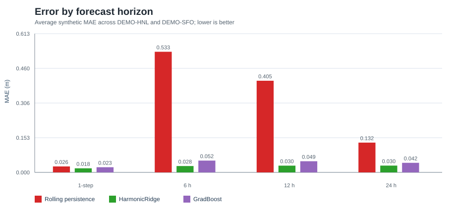
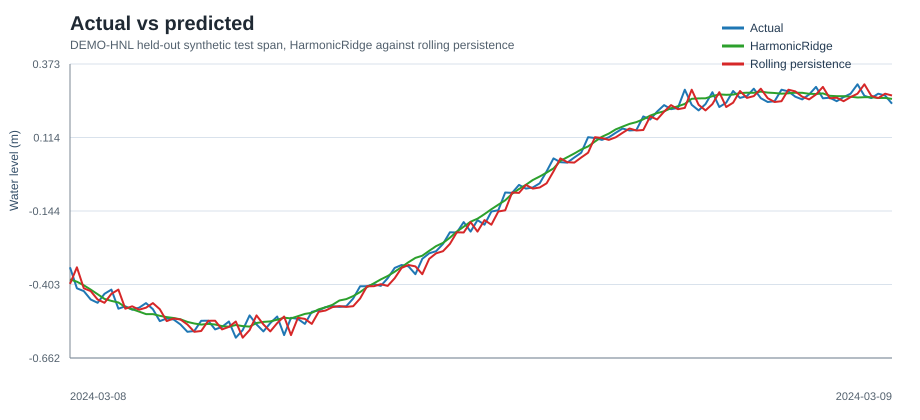
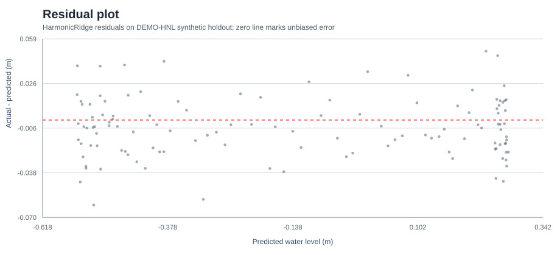
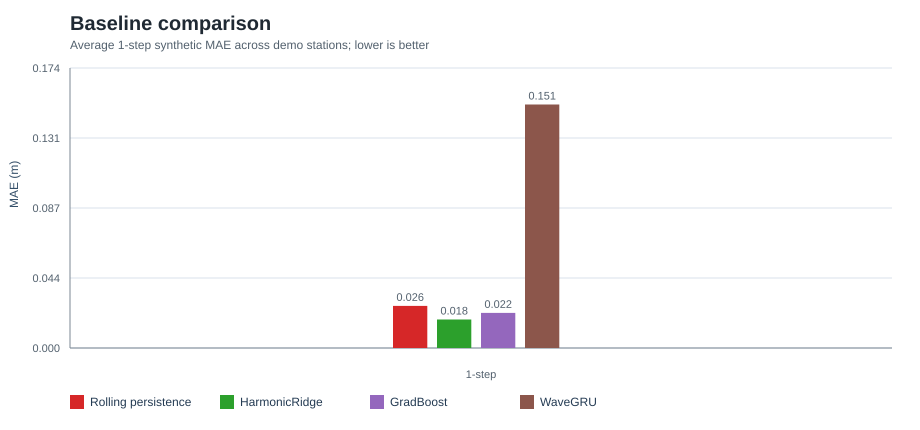

# Wai Research Report

> **Research demo, not an operational forecast system.** The results below
> separate synthetic, tidecast, NOAA mock, and NOAA live evidence. Synthetic
> and mock results are never treated as operational NOAA proof.

## Research Question

Did hybrid tide-aware modeling improve water-level prediction, against what
baseline, and why?

## Short Answer

On the synthetic demo track, yes: the tide-aware HarmonicRidge model reduced
average MAE versus rolling 1-step persistence at every evaluated horizon. The
strongest verified result is the direct multi-horizon synthetic evaluation:
HarmonicRidge averaged 0.0280 m MAE at 6 h versus 0.5329 m for persistence,
and 0.0297 m at 12 h versus 0.4050 m for persistence.

That is not operational NOAA evidence. On NOAA mock fixtures, the NOAA tidal
prediction baseline remained better than the hybrid residual Ridge model on
average. There is no checked-in NOAA live metrics artifact in this snapshot;
`reports/scientific_evidence_audit.*` records that as an open evidence gap
instead of allowing mock output to stand in for live proof.

## Hypothesis

A model that encodes tidal periodicity and learns residual structure should
beat a naive last-value baseline, especially beyond the very short 6-minute
horizon where persistence is already strong.

## Evidence Tracks

| Track | Data | Question answered | Operational evidence? |
| --- | --- | --- | --- |
| Synthetic sanity checks | `data/demo/demo_water_levels.csv` | Can the pipeline recover a known tidal signal without leakage? | No |
| Synthetic rolling-origin | Same synthetic stations, expanding folds | Does the improvement persist across forward-in-time folds? | No |
| Tidecast benchmark | NOAA-derived tidal predictions | Do pure-Python prototypes beat persistence on smooth tidal predictions? | No |
| NOAA mock evaluation | Synthetic fixtures shaped like NOAA API output | Does the NOAA merge/eval/report path work offline? | No |
| NOAA live evaluation | NOAA observations plus NOAA predictions | Real-data baseline comparison when run with network access | Potentially, but no live artifact is checked in here |
| Scientific evidence audit | Current checked-in reports | Are the live NOAA, mock, operational, and forcing boundaries explicit? | No; it is a guardrail, not a performance result |

## Baselines

- `rolling_persistence`: primary naive baseline, `pred[t] = observed[t-1]`.
- `persistence_constant`: reference floor that holds the last train value.
- `noaa_prediction`: deterministic NOAA tidal prediction baseline.
- `noaa_residual_persistence`: NOAA prediction plus rolling residual persistence.
- Tidecast persistence: last value in the input window.

## Models

- `harmonic_ridge`: Ridge regression over tidal harmonics, time features, lag
  observations, and rolling statistics.
- `grad_boost`: scikit-learn gradient boosting over the same engineered
  feature set.
- `hybrid_residual_ridge`: NOAA prediction plus Ridge-modeled residual.
- Optional forcing columns: the tabular feature pipeline can use numeric
  `wind_speed_mps`, `wind_direction_deg`, `air_pressure_hpa`, `rainfall_mm`,
  and `wave_height_m` columns when supplied. The checked-in reports do not
  supply those covariates.
- Prototype benchmark models: lightweight pure-Python ideas. `WaveGRU` is a
  smoothing heuristic, not a real GRU or deep-learning model.

## Metrics

The headline metric is MAE in source units, with RMSE, R2/NSE, correlation,
skill scores, event metrics, rolling-origin folds, and conformal coverage used
as supporting checks. Positive skill means lower error than the baseline.

## Results by Horizon

Average synthetic MAE across `DEMO-HNL` and `DEMO-SFO`:

| Horizon | Rolling persistence MAE | HarmonicRidge MAE | MAE reduction | GradBoost MAE | Evidence track |
| --- | ---: | ---: | ---: | ---: | --- |
| 1-step / 6 min | 0.0262 | 0.0179 | 31.6% lower | 0.0228 | Synthetic direct holdout |
| 6 h | 0.5329 | 0.0280 | 94.7% lower | 0.0522 | Synthetic direct holdout |
| 12 h | 0.4050 | 0.0297 | 92.7% lower | 0.0492 | Synthetic direct holdout |
| 24 h | 0.1316 | 0.0299 | 77.2% lower | 0.0423 | Synthetic direct holdout |



## What Improved

HarmonicRidge improved over rolling persistence on the synthetic 1-step
holdout: average MAE fell from 0.0262 m to 0.0177 m. It also improved in all
six rolling-origin folds, with average fold-level MAE skill of about 27.5% on
`DEMO-HNL` and 41.9% on `DEMO-SFO`.

The ablation track supports the feature story: `reports/summary.json` reports
that full tidal, lag, and rolling features improved MAE over harmonics-only
for both synthetic stations. Harmonics-only R2 ranged from 0.9240 to 0.9838,
so the honest claim is not "harmonics alone solve it"; it is "tidal structure
plus residual features helped on the synthetic benchmark."



## What Did Not Improve

The tidecast prototype benchmark did not show a meaningful prototype win over
last-value persistence. The current average RMSE is 0.222 for persistence and
0.222 for `TinyTide`; `WaveGRU` is worse at 0.911. This track uses smooth
NOAA-derived tidal predictions, not observations.

The NOAA mock track also does not support a claim that the hybrid residual
model beats NOAA tidal predictions. Across the mock stations, average MAE was
0.0404 for NOAA prediction and 0.0430 for hybrid residual Ridge, meaning the
hybrid residual model was worse than the NOAA baseline in that offline fixture.
This is still useful because it proves the eval code is not biased toward
declaring wins.

The scientific audit does not add a win. It adds guardrails: live NOAA metrics
must be generated as `reports/noaa_live_metrics.*` with `mock_used=false`, and
the absence of that artifact is reported as `missing_live_noaa_metrics`.

Conformal coverage did not perfectly hit 90% on event samples. HarmonicRidge
overall coverage was 87.5% on `DEMO-HNL` and 89.0% on `DEMO-SFO`, while event
coverage was lower. That is a scientific weakness, not a dashboard bug.



## Why the Hybrid Approach Helped

Rolling persistence is strong at 6 minutes but weak when the target moves
through tidal phase. Harmonic features give the model a clock for known tidal
cycles, while lag and rolling features capture recent residual behavior that
pure harmonics miss. Ridge regularization keeps the model simple and stable.

For longer direct horizons, the model is trained to predict the target at that
specific offset, so it can use tidal phase directly instead of repeating the
last observed value. That explains the large synthetic gains at 6 h and 12 h.



## Limitations

- Synthetic results are correctness and leakage checks, not operational skill.
- Tidecast data is deterministic tidal prediction output, not gauge
  observations.
- NOAA mock is a CI/offline fixture, not real NOAA performance.
- No verified live NOAA metrics artifact is checked in with this snapshot; the
  scientific audit makes that explicit.
- The feature pipeline now accepts optional meteorological covariates, but no
  checked-in benchmark supplies real wind, pressure, rainfall, wave, or
  atmospheric forecast inputs. Storm-surge skill is therefore not validated.
- The station set is tiny and station-specific; there is no demonstrated
  spatial generalization.
- Conformal intervals rely on exchangeability, which tidal time series can
  violate, especially during events.
- No deep-learning claim is made. The repo uses lightweight statistical and
  scikit-learn models.

## Reproducible Path

```bash
make demo
make test
make coverage
make dashboard
make scientific-audit
```

`make dashboard` starts a local Streamlit server and is meant to be stopped
manually after visual inspection.
